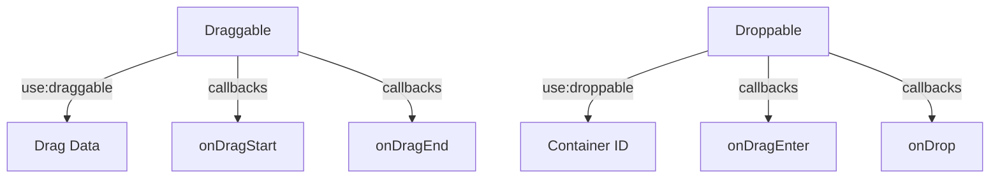

# SvelteDnD

A lightweight drag and drop library for Svelte 5 applications. Built with TypeScript and Svelte's new runes system.

## Installation

```bash
npm install sveltednd
```

## Quick Start

```typescript
import { draggable, droppable } from 'sveltednd';
import 'sveltednd/styles.css';

// Create a list of items
let items = $state(['Item 1', 'Item 2', 'Item 3']);

// Handle drops between containers
function handleDrop(state) {
	const { draggedItem, sourceContainer, targetContainer } = state;
	if (!targetContainer || sourceContainer === targetContainer) return;

	items = items.filter((item) => item !== draggedItem);
	items = [...items, draggedItem];
}
```

```svelte
<!-- Make a droppable container -->
<div use:droppable={{ container: 'list', callbacks: { onDrop: handleDrop } }}>
	{#each items as item}
		<!-- Make items draggable -->
		<div use:draggable={{ container: 'list', dragData: item }}>
			{item}
		</div>
	{/each}
</div>
```

## Core Concepts

### 1. Draggable Items

- Add `use:draggable` to make elements draggable
- Specify container ID and data to transfer
- Optional callbacks for drag start/end

### 2. Droppable Containers

- Add `use:droppable` to create drop zones
- Handle drops via callbacks
- Visual feedback during drag operations

### 3. State Management

- Built-in state tracking via Svelte 5 runes
- Access current drag state via `dndState` store
- Automatic cleanup and memory management

## API Design

Our API is designed with simplicity and usability in mind. Each action (`draggable` and `droppable`) is intuitive, allowing developers to easily implement drag-and-drop functionality without deep diving into complex configurations. The use of callbacks provides flexibility, enabling custom behavior during drag events. This design philosophy ensures that developers can focus on building features rather than wrestling with the library.

### API Overview



## API Reference

### Draggable Action

```typescript
interface DraggableOptions {
  container: string;      // Container identifier
  dragData: any;         // Data to transfer
  disabled?: boolean;    // Disable dragging
  callbacks?: {
    onDragStart?: (state: DragDropState) => void;
    onDragEnd?: (state: DragDropState) => void;
  }
}

// Usage
<div use:draggable={{
  container: "my-list",
  dragData: item,
  callbacks: {
    onDragStart: (state) => console.log('Started dragging', state)
  }
}}>
```

### Droppable Action

```typescript
interface DroppableOptions {
  container: string;      // Container identifier
  disabled?: boolean;    // Disable dropping
  callbacks?: {
    onDragEnter?: (state: DragDropState) => void;
    onDragLeave?: (state: DragDropState) => void;
    onDragOver?: (state: DragDropState) => void;
    onDrop?: (state: DragDropState) => Promise<void> | void;
  }
}

// Usage
<div use:droppable={{
  container: "my-list",
  callbacks: {
    onDrop: async (state) => handleDrop(state)
  }
}}>
```

### DragDropState Interface

```typescript
interface DragDropState {
	isDragging: boolean; // Current drag status
	draggedItem: any; // Item being dragged
	sourceContainer: string; // Origin container ID
	targetContainer: string | null; // Current target container ID
}
```

## Examples

### Basic List

```svelte
<script lang="ts">
	let items = $state(['Item 1', 'Item 2', 'Item 3']);

	function handleDrop(state: DragDropState) {
		const { draggedItem } = state;
		items = [...items, draggedItem];
	}
</script>

<div use:droppable={{ container: 'list', callbacks: { onDrop: handleDrop } }}>
	{#each items as item}
		<div use:draggable={{ container: 'list', dragData: item }}>
			{item}
		</div>
	{/each}
</div>
```

### Multiple Containers

```svelte
<script lang="ts">
	let container1 = $state(['A', 'B']);
	let container2 = $state(['C', 'D']);

	function handleDrop(state: DragDropState) {
		const { sourceContainer, targetContainer, draggedItem } = state;

		if (sourceContainer === 'container1') {
			container1 = container1.filter((i) => i !== draggedItem);
			container2 = [...container2, draggedItem];
		} else {
			container2 = container2.filter((i) => i !== draggedItem);
			container1 = [...container1, draggedItem];
		}
	}
</script>

<div class="flex gap-4">
	<div use:droppable={{ container: 'container1', callbacks: { onDrop: handleDrop } }}>
		{#each container1 as item}
			<div use:draggable={{ container: 'container1', dragData: item }}>
				{item}
			</div>
		{/each}
	</div>

	<div use:droppable={{ container: 'container2', callbacks: { onDrop: handleDrop } }}>
		{#each container2 as item}
			<div use:draggable={{ container: 'container2', dragData: item }}>
				{item}
			</div>
		{/each}
	</div>
</div>
```

### Conditional Dropping

```svelte
<script lang="ts">
  function handleDragOver(state: DragDropState) {
    const { draggedItem } = state;
    // Prevent dropping if item doesn't meet criteria
    if (!isValidItem(draggedItem)) {
      return false;
    }
  }
</script>

<div use:droppable={{
  container: "filtered",
  callbacks: {
    onDragOver: handleDragOver,
    onDrop: handleDrop
  }
}}>
```

### Additional Examples

- **Kanban Board**: Find the example in `src/routes/kanban/+page.svelte`.
- **Simple Sortable List**: Refer to `src/routes/simple-list/+page.svelte`.
- **Grid Sort**: Check out the implementation in `src/routes/grid-sort/+page.svelte`.
- **Horizontal Scroll**: See how it works in `src/routes/horizontal-scroll/+page.svelte`.
- **Nested Containers**: Explore the example in `src/routes/nested/+page.svelte`.

## Styling

The library provides CSS classes for styling drag and drop states:

```css
/* Base styles */
.svelte-dnd-draggable {
	cursor: grab;
}

/* Active dragging */
.svelte-dnd-dragging {
	opacity: 0.5;
	cursor: grabbing;
}

/* Valid drop target */
.svelte-dnd-drop-target {
	outline: 2px dashed #4caf50;
}

/* Invalid drop target */
.svelte-dnd-invalid-target {
	outline: 2px dashed #f44336;
}
```

## TypeScript Support

The library is written in TypeScript and provides full type definitions. Use interfaces to type your dragged items:

```typescript
interface Task {
	id: string;
	title: string;
}

function handleDrop(state: DragDropState) {
	const draggedTask = state.draggedItem as Task;
	// TypeScript now knows the shape of draggedTask
}
```

## Performance Tips

1. Use unique IDs as keys in loops
2. Keep drag data minimal
3. Avoid expensive operations in drag callbacks
4. Use `$derived` for computed values

## License

MIT

## Acknowledgment

SvelteDnD is proudly built by [ThisUX](https://thisux.com) – A Design led product studio. If you need help building your next product, [let's talk](https://cal.com/imsanju/15min).
