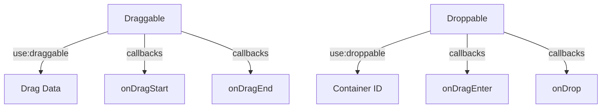

# SvelteDnD

A lightweight drag and drop library for Svelte 5 applications. Built with TypeScript and Svelte's new runes system.

## Installation

```bash
npm i @thisux/sveltednd@latest
# or bun add @thisux/sveltednd or yarn add @thisux/sveltednd or pnpm add @thisux/sveltednd
```

## Quick Start

````svelte
<script lang="ts">
import { draggable, droppable, type DragDropState } from '@thisux/sveltednd';

// Create a list of items
let items = $state(['Item 1', 'Item 2', 'Item 3']);

// Handle drops between containers
function handleDrop(state: DragDropState<{ id: string }>) {
	const { draggedItem, sourceContainer, targetContainer } = state;
	if (!targetContainer || sourceContainer === targetContainer) return;

	// Update items based on the drop
	items = items.filter((item) => item !== draggedItem);
	items = [...items, draggedItem];
}
</script>

<!-- Make a droppable container -->
<div use:droppable={{ container: 'list', callbacks: { onDrop: handleDrop } }}>
	{#each items as item}
		<!-- Make items draggable -->
		<div use:draggable={{ container: 'list', dragData: item }}>
			{item}
		</div>
	{/each}
</div>
````

## Core Concepts

### 1. Draggable Items

- Add `use:draggable` to make elements draggable
- Specify container ID and data to transfer
- Optional callbacks for drag start/end

### 2. Droppable Containers

- Add `use:droppable` to create drop zones
- Handle drops via callbacks
- Visual feedback during drag operations

### 3. State Management

- Built-in state tracking via Svelte 5 runes
- Access current drag state via `dndState` store
- Automatic cleanup and memory management

## API Design

Our API is designed with simplicity and usability in mind. Each action (`draggable` and `droppable`) is intuitive, allowing developers to easily implement drag-and-drop functionality without deep diving into complex configurations. The use of callbacks provides flexibility, enabling custom behavior during drag events. This design philosophy ensures that developers can focus on building features rather than wrestling with the library.

### API Overview



## API Reference

### Draggable Action

```typescript
interface DraggableOptions {
  container: string;      // Container identifier
  dragData: any;         // Data to transfer
  disabled?: boolean;    // Disable dragging
  callbacks?: {
    onDragStart?: (state: DragDropState) => void;
    onDragEnd?: (state: DragDropState) => void;
  }
}
```

```svelte
// Usage
<div use:draggable={{
  container: "my-list",
  dragData: item,
  callbacks: {
    onDragStart: (state) => console.log('Started dragging', state)
  }
}}>
```

### Droppable Action

```typescript
interface DroppableOptions {
  container: string;      // Container identifier
  disabled?: boolean;    // Disable dropping
  callbacks?: {
    onDragEnter?: (state: DragDropState) => void;
    onDragLeave?: (state: DragDropState) => void;
    onDragOver?: (state: DragDropState) => void;
    onDrop?: (state: DragDropState) => Promise<void> | void;
  }
}
```

```svelte
// Usage
<div use:droppable={{
  container: "my-list",
  callbacks: {
    onDrop: async (state) => handleDrop(state)
  }
}}>
```

### DragDropState Interface

```typescript
interface DragDropState<T = unknown> {
	isDragging: boolean; // Current drag status
	draggedItem: T; // Item being dragged
	sourceContainer: string; // Origin container ID
	targetContainer: string | null; // Current target container ID
	attributes?: DragDropAttributes; // Drag attributes
}

interface DragDropAttributes {
	draggingClass?: string; // Custom class for dragging state
	dragOverClass?: string; // Custom class for drag-over state
}
```

## Examples

### Basic List

```svelte
<script lang="ts">
	import { draggable, droppable, type DragDropState } from '@thisux/sveltednd';

	interface Item {
		id: string;
		name: string;
	}

	let items = $state<Item[]>([
		{ id: '1', name: 'Item 1' },
		{ id: '2', name: 'Item 2' },
		{ id: '3', name: 'Item 3' }
	]);

	function handleDrop(state: DragDropState<Item>) {
		const { draggedItem } = state;
		items = [...items, draggedItem];
	}
</script>

<div use:droppable={{ container: 'list', callbacks: { onDrop: handleDrop } }}>
	{#each items as item}
		<div use:draggable={{ container: 'list', dragData: item }}>
			{item.name}
		</div>
	{/each}
</div>
```

### Multiple Containers

```svelte
<script lang="ts">
	import { draggable, droppable, type DragDropState } from '@thisux/sveltednd';

	interface Item {
		id: string;
		name: string;
	}

	let container1 = $state<Item[]>([
		{ id: 'a', name: 'A' },
		{ id: 'b', name: 'B' }
	]);

	let container2 = $state<Item[]>([
		{ id: 'c', name: 'C' },
		{ id: 'd', name: 'D' }
	]);

	function handleDrop(state: DragDropState<Item>) {
		const { sourceContainer, targetContainer, draggedItem } = state;

		if (sourceContainer === 'container1') {
			container1 = container1.filter((i) => i.id !== draggedItem.id);
			container2 = [...container2, draggedItem];
		} else {
			container2 = container2.filter((i) => i.id !== draggedItem.id);
			container1 = [...container1, draggedItem];
		}
	}
</script>

<div class="flex gap-4">
	<div use:droppable={{ container: 'container1', callbacks: { onDrop: handleDrop } }}>
		{#each container1 as item}
			<div use:draggable={{ container: 'container1', dragData: item }}>
				{item.name}
			</div>
		{/each}
	</div>

	<div use:droppable={{ container: 'container2', callbacks: { onDrop: handleDrop } }}>
		{#each container2 as item}
			<div use:draggable={{ container: 'container2', dragData: item }}>
				{item.name}
			</div>
		{/each}
	</div>
</div>
```

### Conditional Dropping

```svelte
<script lang="ts">
	import { draggable, droppable, type DragDropState } from '@thisux/sveltednd';

	interface Item {
		id: string;
		name: string;
		category: string;
	}

	let items = $state<Item[]>([
		{ id: '1', name: 'Item 1', category: 'A' },
		{ id: '2', name: 'Item 2', category: 'B' },
		{ id: '3', name: 'Item 3', category: 'A' }
	]);

	function isValidItem(item: Item): boolean {
		// Example criterion: Only allow dropping items from category 'A'
		return item.category === 'A';
	}

	function handleDragOver(state: DragDropState<Item>) {
		const { draggedItem } = state;
		// Prevent dropping if item doesn't meet criteria
		if (!isValidItem(draggedItem)) {
			// Optionally, add a class to indicate invalid drop target
			dndState.invalidDrop = true;
		} else {
			dndState.invalidDrop = false;
		}
	}

	function handleDrop(state: DragDropState<Item>) {
		const { draggedItem, targetContainer } = state;
		if (!targetContainer || !isValidItem(draggedItem)) return;

		// Handle the drop action
		// For example, move the item to a different category or list
		items = items.map((item) =>
			item.id === draggedItem.id ? { ...item, category: targetContainer } : item
		);
	}
</script>

<div
	use:droppable={{
		container: 'filtered',
		callbacks: {
			onDragOver: handleDragOver,
			onDrop: handleDrop
		}
	}}
>
	{#each items as item}
		<div use:draggable={{ container: 'filtered', dragData: item }}>
			{item.name}
		</div>
	{/each}
</div>
```

### Custom Classes for Drag and Drop States

```svelte
<script lang="ts">
	import { draggable, droppable, type DragDropState } from '$lib/index.js';
	import { flip } from 'svelte/animate';
	import { fade } from 'svelte/transition';

	interface Item {
		id: string;
		title: string;
		description: string;
		priority: 'low' | 'medium' | 'high';
	}

	const items = $state<Item[]>([
		{
			id: '1',
			title: 'Design System Updates',
			description: 'Update color palette and component library',
			priority: 'high'
		},
		{
			id: '2',
			title: 'User Research',
			description: 'Conduct interviews with 5 key customers',
			priority: 'medium'
		},
		{
			id: '3',
			title: 'API Documentation',
			description: 'Document new endpoints and examples',
			priority: 'low'
		}
	]);

	function handleDrop(state: DragDropState<Item>) {
		const { draggedItem, targetContainer } = state;
		const dragIndex = items.findIndex((item: Item) => item.id === draggedItem.id);
		const dropIndex = parseInt(targetContainer ?? '0');

		if (dragIndex !== -1 && !isNaN(dropIndex)) {
			const [item] = items.splice(dragIndex, 1);
			items.splice(dropIndex, 0, item);
		}
	}

	const getPriorityColor = (priority: Item['priority']) => {
		return {
			low: 'bg-blue-50 text-blue-700',
			medium: 'bg-yellow-50 text-yellow-700',
			high: 'bg-red-50 text-red-700'
		}[priority];
	};

	const dragStyles = {
		low: 'bg-gradient-to-r from-sky-400/30 via-blue-400/20 to-indigo-400/30 backdrop-blur-lg',
		medium:
			'bg-gradient-to-r from-amber-400/30 via-orange-400/20 to-yellow-400/30 backdrop-blur-lg',
		high: 'bg-gradient-to-r from-rose-400/30 via-red-400/20 to-pink-400/30 backdrop-blur-lg'
	};
</script>

<div class="min-h-screen bg-gradient-to-br from-slate-50 to-gray-100 p-8">
	<div class="mb-8 flex flex-col gap-2">
		<h1 class="text-2xl font-bold text-gray-900">Custom classes</h1>
		<p class="text-gray-600">You can add custom classes to the draggable and droppable elements.</p>
	</div>

	<div class="w-80">
		<div class="rounded-xl bg-white/40 p-4 shadow-lg ring-1 ring-white/60 backdrop-blur-xl">
			<div class="space-y-4">
				{#each items as item, index (item.id)}
					<div
						use:draggable={{ container: index.toString(), dragData: item }}
						use:droppable={{
							container: index.toString(),
							callbacks: { onDrop: handleDrop },
							attributes: {
								draggingClass: 'scale-105 rotate-2 !shadow-2xl !ring-2 ring-blue-500/50 z-50',
								dragOverClass: 'scale-98 -rotate-1 !shadow-inner !ring-2 ring-emerald-500/50'
							}
						}}
						animate:flip={{ duration: 400, easing: 'cubic-bezier(0.4, 0, 0.2, 1)' }}
						in:fade={{ duration: 300 }}
						out:fade={{ duration: 200 }}
						class="group relative cursor-move rounded-lg p-4
                               shadow-md ring-1 ring-white/60
                               backdrop-blur-md transition-all duration-500
                               ease-out hover:-rotate-1 hover:scale-[1.02]
                               hover:shadow-xl active:shadow-inner
                               {dragStyles[item.priority]}"
					>
						<div class="relative overflow-hidden rounded-md">
							<!-- Enhanced gradient overlay -->
							<div
								class="absolute inset-0 bg-gradient-to-br from-white/10 via-transparent to-white/20 opacity-0
                                      transition-all duration-500 group-hover:opacity-100"
							/>

							<!-- Kanban card content -->
							<div class="relative z-10 space-y-2">
								<div class="flex items-start justify-between">
									<h3 class="font-medium text-gray-900">{item.title}</h3>
									<span
										class="inline-flex items-center rounded-md px-2 py-1 text-xs font-medium
													 {getPriorityColor(item.priority)}"
									>
										{item.priority}
									</span>
								</div>
								<p class="text-sm text-gray-600">{item.description}</p>
							</div>
						</div>
					</div>
				{/each}
			</div>
		</div>
	</div>
</div>

<style>
	:global(.dragging) {
		@apply opacity-60;
		animation: pulse 2s cubic-bezier(0.4, 0, 0.6, 1) infinite;
	}

	@keyframes pulse {
		0%,
		100% {
			opacity: 0.6;
		}
		50% {
			opacity: 0.8;
		}
	}

	:global(.drag-over) {
		@apply bg-blue-50;
	}

	/* Add custom scaling utility */
	.scale-102 {
		transform: scale(1.02);
	}
	.scale-98 {
		transform: scale(0.98);
	}
</style>
```

### Additional Examples

- **[Kanban Board](https://github.com/thisuxhq/SvelteDnD/blob/main/src/routes/+page.svelte)**: Find the example in `src/routes/+page.svelte`.
- **[Simple Sortable List](https://github.com/thisuxhq/SvelteDnD/blob/main/src/routes/simple-list/+page.svelte)**: Refer to `src/routes/simple-list/+page.svelte`.
- **[Grid Sort](https://github.com/thisuxhq/SvelteDnD/blob/main/src/routes/grid-sort/+page.svelte)**: Check out the implementation in `src/routes/grid-sort/+page.svelte`.
- **[Horizontal Scroll](https://github.com/thisuxhq/SvelteDnD/blob/main/src/routes/horizontal-scroll/+page.svelte)**: See how it works in `src/routes/horizontal-scroll/+page.svelte`.
- **[Nested Containers](https://github.com/thisuxhq/SvelteDnD/blob/main/src/routes/nested/+page.svelte)**: Explore the example in `src/routes/nested/+page.svelte`.
- **[Custom Classes](https://github.com/thisuxhq/SvelteDnD/blob/main/src/routes/custom-classes/+page.svelte)**: Explore the example in `src/routes/custom-classes/+page.svelte`.
- **[Interactive Elements](https://github.com/thisuxhq/SvelteDnD/blob/main/src/routes/interactive-elements/+page.svelte)**: Explore the example in `src/routes/interactive-elements/+page.svelte`.
- **[Conditional Check](https://github.com/thisuxhq/SvelteDnD/blob/main/src/routes/conditional-check/+page.svelte)**: Explore the example in `src/routes/conditional-check/+page.svelte`.

## Styling

The library provides CSS classes for styling drag and drop states:

```css
/* Base styles */
.svelte-dnd-draggable {
	cursor: grab;
}

/* Active dragging */
.svelte-dnd-dragging {
	opacity: 0.5;
	cursor: grabbing;
}

/* Valid drop target */
.svelte-dnd-drop-target {
	outline: 2px dashed #4caf50;
}

/* Invalid drop target */
.svelte-dnd-invalid-target {
	outline: 2px dashed #f44336;
}
```

## TypeScript Support

The library is written in TypeScript and provides full type definitions. Use interfaces to type your dragged items:

```typescript
interface Task {
	id: string;
	title: string;
}

function handleDrop(state: DragDropState<Task>) {
	const draggedTask = state.draggedItem;
	// Handle the dropped task
}
```

## Performance Tips

1. Use unique IDs as keys in loops
2. Keep drag data minimal
3. Avoid expensive operations in drag callbacks
4. Use `$derived` for computed values

## License

MIT

## Acknowledgment

SvelteDnD is proudly built by [ThisUX](https://thisux.com) – A Design led product studio. If you need help building your next product, [let's talk](https://cal.com/imsanju/15min).
